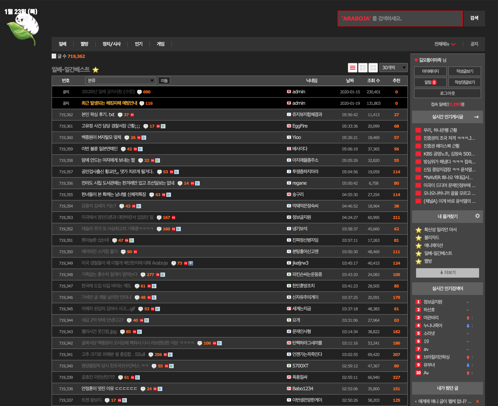

# 일베 다크테마

이 스크립트는 단순 `usercss`임.

- [usercss란?](https://github.com/openstyles/stylus/wiki/Usercss)

## 미리보기

## 설치

[Stylus](https://add0n.com/stylus.html)가 필요함.

[파이어폭스](https://addons.mozilla.org/en-US/firefox/addon/styl-us/), [크롬](https://chrome.google.com/webstore/detail/stylus/clngdbkpkpeebahjckkjfobafhncgmne), [오페라](https://addons.opera.com/en-gb/extensions/details/stylus/), [사파리](https://cascadea.app/)중에 맞는 브라우저 플러그인을 설치

📦 [usercss로 설치](https://raw.githubusercontent.com/nomunyan/dark-ilbe/master/ilbe-dark.user.css) Stylus 플러그인을 설치했다면 이 링크로 설치할 수 있음.

## 라이센스

MIT
